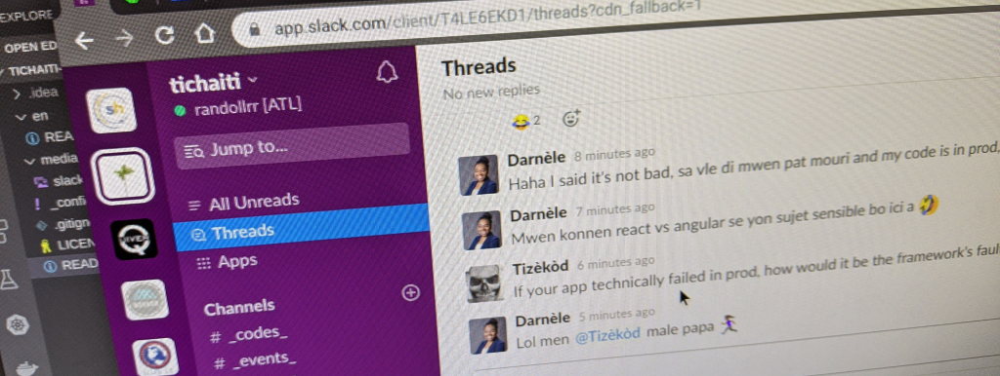

[[English](en/README.md)]

## _#tic #haiti_
"Technologie de l’Information et de la Communication (TIC) et Haiti" 
(pou Ayiti, pou Ayisyen, ak Ayisyen an Ayiti e ay&egrave;)

## On&egrave; ak resp&egrave; pou ou sou paj tichaiti

Nou se yon group moun ki grandi nan yon espas sou Slack pou rezon ki senp, nou vle ke nou se yon kominote aktif -- yon kominote Ayisyan ki nan Teknoloji ki ap angaje, pataje epi pale de tout d&egrave;nye Teknoloji Enf&ograve;matik yo.

Pou ou ka chill/hangout av&egrave;k nou, ale sou: [slack.tichaiti.dev](http://slack.tichaiti.dev)

## Si'w vle pran nouv&egrave;l nou epi gade sa n'ap f&egrave; 

- nou toujou sou Slack: [slack.tichaiti.dev](https://slack.tichaiti.dev)
- nou oganize nou sou Trello: [trello.com/tichaiti](https://trello.com/tichaiti)
- nou kode sou Github: [github.com/tichaiti](https://github.com/tichaiti)
- epi prezantasyon nou f&egrave;t sou Youtube: [youtube.com/tichaiti](https://www.youtube.com/tichaiti)

## Tech-Talks Live _(L&egrave; Samdi 15:30)_
A series of live chit-chats on *"software development beyong programming laguages"*
