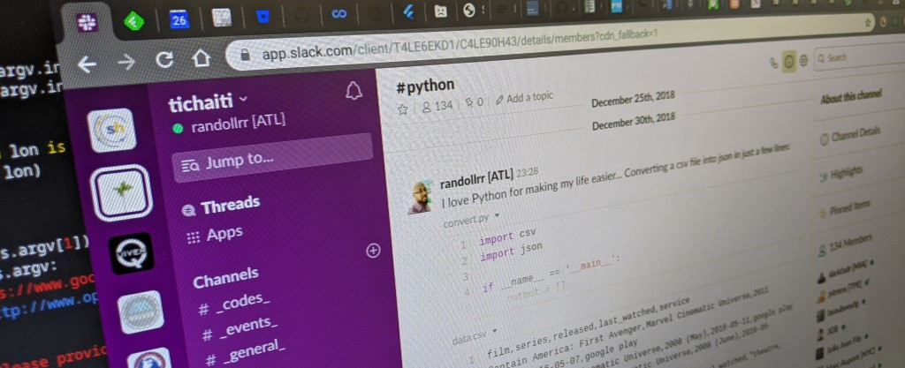

[[Krey&ograve;l](../README.md)]

## _#tic #haiti_
"Technologie de l'Information et de la Communication (TIC) et Haiti"  
(for Haiti, for Haitians, in Haiti and beyond)

## Welcome to tichaiti

We started out as a community on Slack (a workspace) because we wanted to be an active community, a Haitian-in-Tech community that's doing, sharing and discussing all the latest Information Technologies.

Come hangout with us at: [slack.tichaiti.dev](http://slack.tichaiti.dev)

## Wanna keep up with us and stay in the loop

- we hang out on Slack: [slack.tichaiti.dev](https://slack.tichaiti.dev)
- we organize on Trello: [trello.com/tichaiti](https://trello.com/tichaiti)
- we code on Github: [github.com/tichaiti](https://github.com/tichaiti)
- and we present on Youtube: [youtube.com/tichaiti](https://www.youtube.com/tichaiti)

## Tech-Talks Live _(Saturday Nights)_
A series of live chit-chats on *"software development beyong programming laguages"*
